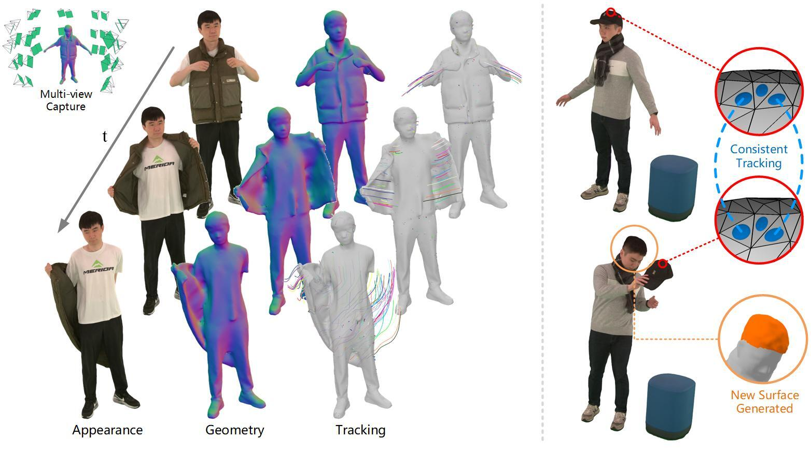

[//]: # (# Official Repository of GauSTAR)

<h2 align="center">
<b>GauSTAR:</b> Gaussian Surface Tracking and Reconstruction
</h2>

<p align="center" style="margin:0">
    <a href="https://chengwei-zheng.github.io/">Chengwei Zheng</a>
    ·
    <a href="https://lxxue.github.io/">Lixin Xue</a>
    ·
    <a href="https://ait.ethz.ch/people/jzarate">Juan Zarate</a>
    ·
    <a href="https://ait.ethz.ch/people/song">Jie Song</a>
</p>

<h3 align="center" style="margin-top:-10px;">
  <p>CVPR 2025</p>
  <a href="http://arxiv.org/abs/2501.10283">Paper</a>
  | <a href="https://www.youtube.com/watch?v=NQALobcY6vk">Video</a>
  | <a href="https://eth-ait.github.io/GauSTAR/">Project Page</a>
</h3>

<p align="center">
  
  <br>
    <em>GauSTAR enables photo-realistic rendering, surface reconstruction, and 3D tracking for dynamic scenes from multiview inputs while handling topology changes.</em>
</p>

---

## Overview and contents

This repository provides the offcial implementation of **GauSTAR**. Due to license restrictions, we cannot provide the sequences shown in the paper. 
Instead, we provide the implementation on the public available [ActorsHQ](https://actors-hq.com/) dataset.

GauSTAR requires multiview RGB and depth inputs.
Since ActorsHQ does not provide depth images, we use [HumanRF](https://github.com/synthesiaresearch/humanrf) to first reconstruct 3D meshes and then render depth images as input to GauSTAR.

### Table of Contents

<details>
<summary><a href="#data-processing-on-actorshq-dataset"><strong>Data processing on ActorsHQ dataset</strong></a></summary>

- [HumanRF training](#humanrf-training)  
- [HumanRF mesh extraction](#humanrf-mesh-extraction)  
- [Depth generation and data conversion](#depth-generation-and-data-conversion)  
- [Optical flow prediction](#optical-flow-prediction)  
- [Data structure](#data-structure)  

</details>

<details>
<summary><a href="#gaustar-training"><strong>GauSTAR training</strong></a></summary>

- [Environment setup](#environment-setup)  
- [Training](#training)  
- [Output format](#output-format)  
- [Utilities](#utilities)  

</details>

<details>
<summary><a href="#faq"><strong>FAQ</strong></a></summary>
</details>

---

## Data processing on ActorsHQ dataset

We adapt the original HumanRF framework to generate 3D meshes and render depth images for the ActorHQ dataset. 

The following instructions use Actor01 Sequence1 from frame 40 to 80 as an example. 
Please modify the parameters accordingly if you are using a different sequence or frame range.

### HumanRF training

Install the HumanRF environment. Detailed instructions can be found in the [HumanRF README](data_process/humanrf/README.md#installation).

```bash
cd data_process/humanrf/
conda create -n humanrf

# Install GLM
sudo apt-get install libglm-dev

# Install required packages and Tiny CUDA NN.
pip install -r requirements.txt
pip install git+https://github.com/NVlabs/tiny-cuda-nn/#subdirectory=bindings/torch

# Install ActorsHQ package (dataset and data loader)
cd actorshq
pip3 install .

# Install HumanRF package (method)
cd ../humanrf
pip3 install .

# Install AIT-viwer for depth rendering
pip install aitviewer

# Add the installation folder to the PYTHONPATH
export PYTHONPATH=$PYTHONPATH:/path/to/repo
```

Download the ActorsHQ dataset and run HumanRF training.
```bash
python actorshq/dataset/download_manager.py \
    actorshq_access_4x.yaml \
    /<your_actorshq_path>/actorshq \
    --actor Actor01 \
    --sequence Sequence1 \
    --scale 4 \
    --frame_start 40 \
    --frame_stop 80

python humanrf/run.py \
    --config example_humanrf_GauSTAR \
    --workspace /<your_humanrf_output_path>/humanrf_example_output \
    --dataset.path /<your_actorshq_path>/actorshq
```

Note that the access file `actorshq_access_4x.yaml` needs to be requested from the [official ActorsHQ website](https://actors-hq.com/#dataset).

After training, the checkpoint will be saved at 
`/<your_humanrf_output_path>/humanrf_example_output/checkpoints/best.pth`. 

We also provide a pre-trained checkpoint [here](https://drive.google.com/file/d/1FTjVFDyo2gE_RZPPTSnl223kL7WLEmUz/view?usp=sharing) (only for Actor01 Sequence1, frame 40 to 80).

You can customize training parameters (such as selecting the sequence, adjusting the frame range, and setting the number of training steps) by editing the configuration file in the command above (e.g., `data_process/humanrf/humanrf/configs/example_humanrf_GauSTAR.py`).

### HumanRF mesh extraction

Once training is complete, run the mesh extraction script with the same command-line arguments as in training:

```bash
python humanrf/run_mesh_extract_GauSTAR.py \
    --config example_humanrf_GauSTAR \
    --workspace /<your_humanrf_output_path>/humanrf_example_output \
    --dataset.path /<your_actorshq_path>/actorshq
```

The extracted meshes will be saved to: `/<your_humanrf_output_path>/humanrf_example_output/results/mesh/`

### Depth generation and data conversion

Use the following script to convert the ActorsHQ dataset to the GauSTAR format.

```bash
cd ..
python ahq2gaustar.py \
    --gaustar_data_dir /<your_gaustar_data_path>/gaustar_data_example/ \
    --actorshq_dir /<your_actorshq_path>/actorshq/Actor01/Sequence1/4x/ \
    --mesh_dir /<your_humanrf_output_path>/humanrf_example_output/results/mesh/ \
    --frame_0 40 \
    --frame_end 80
```

### Optical flow prediction

We use [RAFT](https://github.com/princeton-vl/RAFT) to predict optical flow. 
The main function is modified to compute bidirectional flow, allowing us to filter out inconsistent estimations.

First, set up the RAFT environment:
```Shell
cd RAFT
conda create --name raft
conda activate raft
conda install pytorch=1.6.0 torchvision=0.7.0 cudatoolkit=10.1 matplotlib tensorboard scipy opencv -c pytorch
```

Then download the pre-trained RAFT model:
```Shell
./download_models.sh
```

Run oprical flow prediction:
```Shell
python demo_GauSTAR.py \
    --model=models/raft-things.pth \
    --path=/<your_gaustar_data_path>/gaustar_data_example/ \
    --frame_0=40 \
    --frame_end=80
```

### Data structure

After data preprocessing, your `gaustar_data_example` folder should have the following structure:

```
└── gaustar_data_example
    ├── 0040
    │   ├── depth_humanrf
    │   │   ├── img_0000_depth.jpg (only for visualization)
    │   │   ├── img_0000_depth.npz
    │   │   ... (to 159)
    │   ├── flow_bi
    │   │   ├── 0000_b.jpg (only for visualization)
    │   │   ├── 0000_b.npz
    │   │   ├── 0000_f.jpg (only for visualization)
    │   │   ├── 0000_f.npz
    │   │   ... (to 159)
    │   ├── images
    │   │   ├── img_0000.jpg
    │   │   ... (to 159)
    │   ├── masks_humanrf
    │   │   ├── img_0000_alpha.png
    │   │   ... (to 159)
    │   └── sparse (only present in the 1st frame folder)
    │       └── 0
    │           ├── cameras.txt
    │           ├── images.txt
    │           └── points3D.ply
    ├── 0041
    ...
    ├── 0080
    ├── init_mesh_100k.obj
    └── rgb_cameras.npz
            
```

---

## GauSTAR training

### Environment setup

<!--
You can set up the GauSTAR environment using the following commands, which primarily use `pip install`. Alternatively, if you prefer to use `conda install`, please refer to the instructions in the *Installation* section from [SuGaR README](https://github.com/Anttwo/SuGaR/tree/main?tab=readme-ov-file#installation), as our implementation is built on top of [SuGaR](https://github.com/Anttwo/SuGaR/tree/main).
-->
You can set up the GauSTAR environment using the following commands.
```Shell
# Install pytorch and pytorch3d, you may need to adjust the CUDA version (here we use CUDA 11.8)
conda create -n gaustar python=3.9
conda activate gaustar
pip install fvcore torch==2.0.1+cu118 torchvision==0.15.2+cu118 torchaudio==2.0.2 --index-url https://download.pytorch.org/whl/cu118
pip install --no-index --no-cache-dir pytorch3d -f https://dl.fbaipublicfiles.com/pytorch3d/packaging/wheels/py39_cu118_pyt201/download.html

# Install additional libraries from requirements.txt
pip install -r requirements.txt

# Install additional Python submodules required for Gaussian Splatting
cd gaussian_splatting/submodules/diff-gaussian-rasterization/
pip install -e .
cd ../simple-knn/
pip install -e .
cd ../../../
```

### Training

First, convert camera parameters to the Gaussian Splatting format. This step only needs to be performed once per dataset.

```Shell
python gaussian_splatting/train.py \
    -s /<your_gaustar_data_path>/gaustar_data_example/0040/ \
    -m /<your_gaustar_data_path>/gaustar_data_example/gs_out/ \
    --convert_cmr_only
```

Then, run GauSTAR training with the following command:

```Shell
python train_seq.py \
    -s /<your_gaustar_data_path>/gaustar_data_example/ \
    -o /<your_gaustar_output_path>/gaustar_output/ \
    --frame_0 40 \
    --frame_end 80 \
    --base_mesh init_mesh_100k.obj \
    --from_humanrf
```

Optional arguments: Use `--disable_mesh_update` to turn off mesh topology updates; use `--SH_reg` to add a color (appearance spherical harmonics) consistency term, which helps improve tracking accuracy.

### Output format

The following is an example output structure of GauSTAR. 
Files and folders marked with * only appear when topology changes are detected and the unbinding with re-meshing step is performed.

```
└── gaustar_output
    ├── 0040
    │   ├── coarse_mesh (contains files for scene flow warping)
    │   │   ├── warp_smooth.obj (mesh after scene flow warping)
    │   │   ├── config.json (log of scene flow warping configuration)
    │   │   ... 
    │   ├── detect (contains files for topology change detection)
    │   │   └── mesh_001000
    │   │       ├── detect_voxel_fc.obj (unbind weight)
    │   │       ... 
    │   ├── render_w (contains rendered images before re-meshing)
    │   │   ├── depth_000000.jpg
    │   │   ├── render_000000.jpg
    │   │   ... 
    │   ├── *merge* (contains files for re-meshing)
    │   ├── 0040.ply (3D Gaussians, viewable at https://superspl.at/editor/)
    │   ├── 2000.pt (Gaussian Splatting ckeckpoint)
    │   ├── color_mesh.obj (mesh before re-meshing)
    │   ├── config.json (log of training configuration)
    │   ├── *extract_sdf_alpha.obj* (mesh extracted from unbound Gaussians)
    │   ├── *face_corr.npz* (face correspondances after re-meshing)
    │   ├── *face_delta_select.obj* (faces selected for updating; colors represent unbind weights)
    │   ├── *updated_mesh.obj* (mesh after re-meshing)
    │   ├── *updated_mesh_log.json* (log of re-meshing configuration)
    │   ...
    ├── *0040_update* (contains results after re-meshing)
    │   ├── *render_w*
    │   ├── *0040_update.ply*
    │   ├── *1000.pt*
    │   ├── *color_mesh.obj*
    │   └── *config.json*
    ├── 0041
    ...
```

### Utilities

#### Image rendering

Images are automatically rendered upon training completion. 
If you need to re-render them (e.g., to change the background color), you can run `render_seq.py` with the same command-line arguments as in training:

```Shell
python render_seq.py \
    -s /<your_gaustar_data_path>/gaustar_data_example/ \
    -o /<your_gaustar_output_path>/gaustar_output/ \
    --frame_0 40 \
    --frame_end 80 \
    --base_mesh init_mesh_100k.obj \
    --from_humanrf
```

To change the background color, modify the `render_results` in `render_seq.py` (e.g., `bd`: render black bg & depth； `w`: render white bg)

---

## FAQ

Common issues are listed here. If you encounter problems, feel free to open an issue.

- **Initial mesh**: `init_mesh_100k.obj` is generated by HumanRF (from `humanrf_example_output/results/mesh/mesh_000040_smooth_100k.obj`). However, it may sometimes contain inner surfaces, which should be removed before running GauSTAR. We provide an outlier removal method in the `extract_geometry_1frame()` function located in `data_process/humanrf/humanrf/trainer.py`, with a default `outlier_threshold=0.2`. If you observe inner surfaces in `init_mesh_100k.obj` (you can check this using Meshlab via *Render -> Shaders -> xray*), try increasing the `outlier_threshold` and re-running `humanrf/run_mesh_extract_GauSTAR.py` to filter them out.

- **Camera parameters**: GauSTAR assumes camera intrinsics with *cx = image_width / 2* and *cy = image_height / 2*, which differs from the intrinsic parameters in ActorsHQ. To address this, we apply an image shift in `ahq2gaustar.py`. Currently, camera parameters are stored in both `gaustar_data_example/gs_out/cameras.json` and `gaustar_data_example/rgb_cameras.npz`, as `cameras.json` does not include the *cx* and *cy* values in the intrinsics. If you need to modify the camera parameters, please make sure to update both files accordingly.

- **Depth images**: In the input depth images, invalid pixels are assigned a large depth value (default is 999 in ait-viewer). We assume that all valid depth values are less than 10 meters. If your dataset contains valid depths greater than 10 meters, please update the `max_depth` parameter in the following files: `gaustar_trainers/refine.py`, `gaustar_trainers/refined_mesh.py`, and `gaustar_tools/warp_mesh.py`.

  
## Acknowledgments

We thank the authors of [HumanRF](https://github.com/synthesiaresearch/humanrf), [SuGaR](https://github.com/Anttwo/SuGaR), and [RAFT](https://github.com/princeton-vl/RAFT) for their excellent work and for making their code publicly available.

## Citation

If you find this work useful, please consider citing:

```bibtex
@InProceedings{zheng2025gaustar,
    author    = {Zheng, Chengwei and Xue, Lixin and Zarate, Juan and Song, Jie},
    title     = {GauSTAR: Gaussian Surface Tracking and Reconstruction},
    booktitle = {Proceedings of the Computer Vision and Pattern Recognition Conference (CVPR)},
    month     = {June},
    year      = {2025},
    pages     = {16543-16553}
}
```
